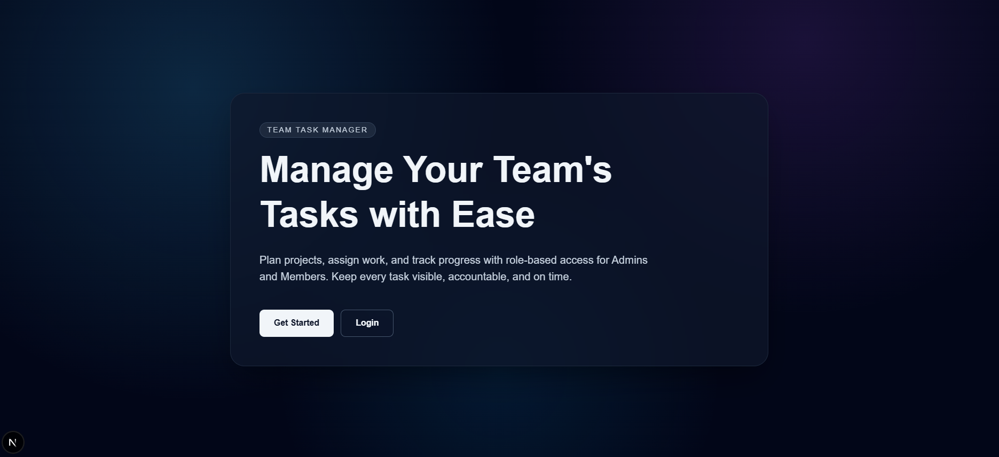

# Team Task Manager
**A modern, role-based collaboration platform to manage team projects, assign tasks, and track execution with clarity.**


## Live Demo
- Production URL: [https://team-task-manager-production-ad56.up.railway.app](https://team-task-manager-production-ad56.up.railway.app)

## Screenshots





## Core Features
- 🔐 **Secure Authentication (JWT):** Token-based login and protected API routes.
- 🛡️ **Role-Based Access Control (RBAC):** Admin and Member permissions enforced across APIs and UI.
- 📌 **Task & Project Management:** Create, assign, update, and track projects/tasks with status workflows.
- 📱 **Responsive Modern UI:** Clean, dark-themed interface built with Tailwind CSS.

## Tech Stack
| Layer | Technology |
|---|---|
| Frontend | Next.js (App Router), TypeScript, Tailwind CSS |
| Backend | Next.js Route Handlers (API), TypeScript |
| Database | MongoDB + Mongoose |
| Auth | JWT (`jsonwebtoken`) + `bcryptjs` |
| Deployment | Railway |

## Installation & Local Setup
```bash
# 1) Clone repository
git clone <your-repo-url>
cd team-task-manager

# 2) Install dependencies
npm install

# 3) Create environment file
cp .env.example .env.local

# 4) Start development server
npm run dev
```

App runs at: [http://localhost:3000](http://localhost:3000)

## Environment Variables
Create a `.env.local` file in the project root with:

```env
MONGODB_URI=
JWT_SECRET=
NEXT_PUBLIC_API_URL=
```

## Architecture Brief
This project uses the **Next.js App Router** with server-side API routes under `app/api`.

```text
app/
  page.tsx                 # Landing page
  login/page.tsx           # Login UI
  register/page.tsx        # Register UI
  dashboard/page.tsx       # Role-aware dashboard UI
  api/
    auth/
      login/route.ts       # Login endpoint
      register/route.ts    # Registration endpoint
    projects/route.ts      # Project CRUD (role-gated)
    tasks/route.ts         # Task CRUD + status updates (role-gated)
    dashboard/route.ts     # Dashboard stats aggregation
    users/route.ts         # Admin-only user list

lib/
  mongodb.ts               # MongoDB connection (global cache)
models/
  User.ts
  Project.ts
  Task.ts
src/lib/
  apiClient.ts             # Frontend API wrapper (JWT headers + error handling)
  auth.ts                  # Request auth helper for API routes
  jwt.ts                   # JWT sign/verify utility
```

## Author
**Deepanshu Sharma**  
B.Tech CSE Student, MIT Moradabad  
LinkedIn: [Add LinkedIn Profile URL](https://www.linkedin.com/)
